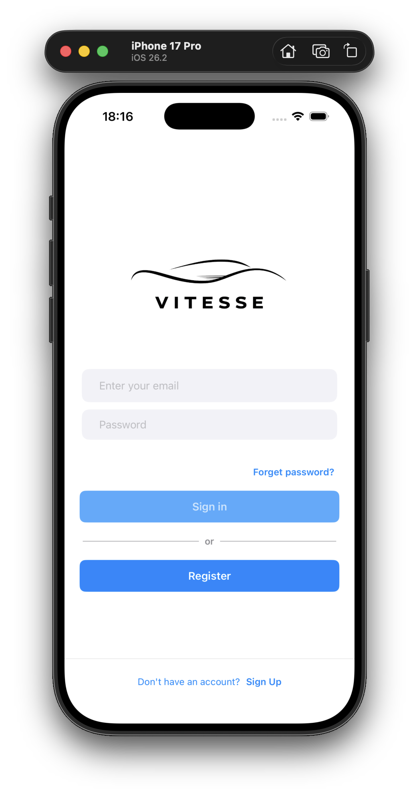
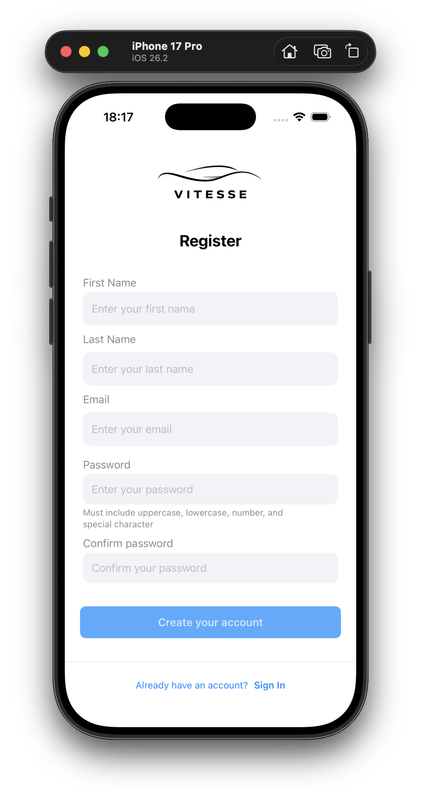
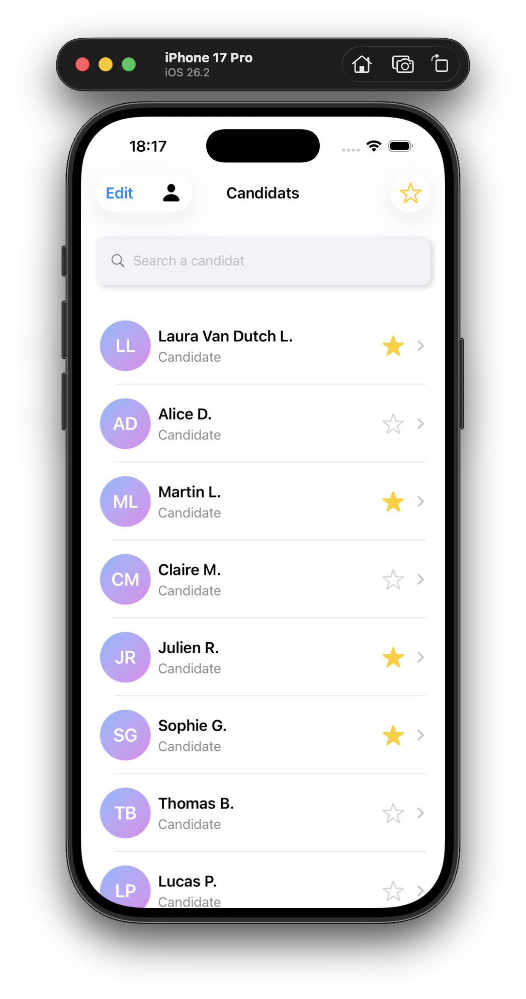
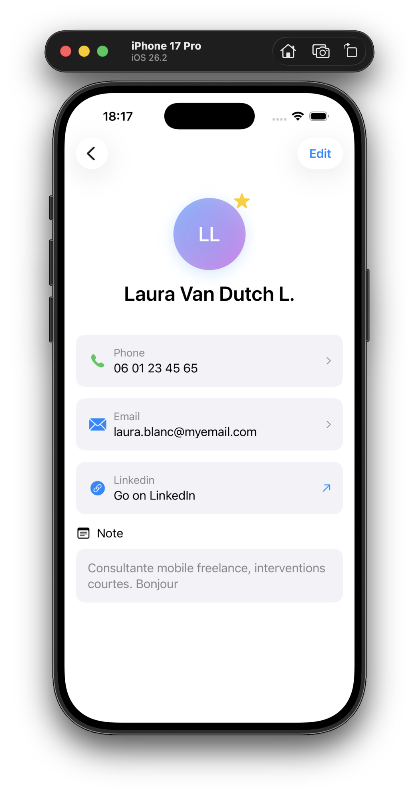

# Vitesse – Candidate Management App (iOS)

Vitesse is an iOS application built with **SwiftUI** and following the **MVVM architecture**.  
The app focuses on user authentication and candidate management, with a strong emphasis on clean architecture, security, and user experience.

This project was designed as a technical exercise to demonstrate best practices in modern iOS development for Open Classrooms in january 2026.

---

## ✨ Features Overview

### 🔐 Authentication

- User registration with form validation
- Secure login using email and password
- Password confirmation and protected input fields
- Authentication handled via a **Vapor backend**
- Authentication based on **JWT (JSON Web Token)** issued by the server
- The JWT token is securely stored and used to maintain the authenticated session
- Robust error handling with clear user feedback

---

### 👥 Candidate Management

- Display a list of candidates
- Search candidates by first name or last name
- Filter candidates by favorite status
- Edit and delete candidates
- View detailed candidate profiles

---

### ⭐ Favorites & Permissions

- Mark candidates as favorites
- Favorite action is restricted to **admin users**
- UI dynamically adapts based on user permissions

---

## 🧱 Architecture

The application follows the **MVVM (Model – View – ViewModel)** pattern:

- **Model**: Represents data structures (User, Candidate, etc.)
- **View**: SwiftUI views responsible only for UI rendering
- **ViewModel**: Handles business logic, state management, validation, and error handling

Each ViewModel relies on **dedicated services**, injected via protocols, to handle data access and business operations.  
This design enables easy mocking of dependencies and allows ViewModels to be tested in isolation.

This separation improves:
- Testability
- Maintainability
- Readability
- Scalability

---

## 🌐 Backend (Vapor)

The backend is built with **Vapor**, a server-side Swift framework.

- Handles user registration and authentication
- Issues **JWT tokens** upon successful login
- Exposes secured REST endpoints for candidate management
- Enforces role-based permissions (admin / standard user)
- Validates and persists data

The iOS app communicates with the backend via HTTPS using a REST API.

---

## 🌐 Networking Layer (HTTP Client & API Endpoints)

The application uses a **custom networking layer** designed to be reusable, testable, and easy to maintain.

### HTTP Client

Network requests are handled by a dedicated `HTTPClient`, responsible for:
- Executing HTTP requests
- Attaching authentication headers when required
- Decoding API responses
- Centralizing error handling

Key characteristics:
- Built on top of **async / await**
- Abstracted behind the `HTTPClientProtocol`
- Uses dependency injection for:
  - `URLSessionProtocol` (to allow mocking during tests)
  - `KeychainHelper` (for secure token access)

When an endpoint requires authentication, the HTTP client automatically:
- Retrieves the JWT token from the **Apple Keychain**
- Injects it into the `Authorization` header using the `Bearer` scheme

This design allows ViewModels and Services to remain completely agnostic of networking and authentication details.

---

### APIEndpoint Abstraction

All backend endpoints are defined using a centralized `APIEndpoint` enum.

Each endpoint explicitly describes:
- The URL path
- The HTTP method (GET, POST, PUT, DELETE)
- Whether authentication is required
- Whether a request body is needed
- How the request body is encoded

This approach provides:
- Strong typing for all API calls
- A single source of truth for backend routes
- Improved readability and maintainability
- Reduced risk of malformed requests

By combining `APIEndpoint` with the `HTTPClient`, the networking layer enforces consistency and makes API interactions predictable and easy to test.

---

### Error Handling

HTTP responses are validated centrally:
- Success responses (2xx) are processed normally
- Authentication errors (401) are mapped to explicit domain errors
- Client and server errors are converted into meaningful error messages
- Unexpected responses are handled gracefully

This ensures:
- Clear feedback to the user
- No leaking of technical or sensitive details
- Consistent error handling across the entire app

---

## 📝 Screens & Functionalities

### 1️⃣ Register Screen

**Purpose:** Create a new user account

**Features**
- First name, last name, email
- Password and password confirmation
- Input validation and error feedback

**Actions**
- Validate user input
- Create a new account upon successful validation

---

### 2️⃣ Login Screen

**Purpose:** Authenticate existing users

**Features**
- Email and password fields
- Navigation to the registration screen

**Actions**
- Validate credentials and authenticate the user
- Redirect to the candidate list on success

---

### 3️⃣ Candidate List Screen

**Purpose:** Browse and manage candidates

**Features**
- Search bar (first name and last name)
- Filter candidates by favorites or all
- Edit mode for batch deletion

**Actions**
- Tap a candidate to view detailed profile
- Enable edit mode to delete one or multiple candidates
- Combine search and favorites filtering

---

### 4️⃣ Candidate Profile Screen

**Purpose:** View and edit candidate details

**Displayed Information**
- Full name
- Phone number
- Email
- LinkedIn profile
- Notes (multiline text)

**Actions**
- Edit candidate information
- Cancel or confirm modifications
- Toggle favorite status (admin users only)

---

## 🔒 Security Considerations

Security has been considered from the early stages of the application design.

- Authentication is based on **JWT (JSON Web Token)**
- The JWT token is **securely stored in the Apple Keychain**, ensuring it is encrypted and protected by the system
- Sensitive information such as passwords is never stored or logged
- Password fields use secure text entry and are never displayed in plain text
- Authentication state relies on the presence and validity of the stored token
- User permissions (e.g. admin access) are enforced at both UI and logic levels
- Centralized error handling prevents sensitive information from being exposed to the user

By leveraging **Apple Keychain Services**, the application follows iOS security best practices.

---

## 🛠 Tech Stack

- **Swift**
- **SwiftUI**
- **MVVM Architecture**
- **Async / Await**
- **Protocol-Oriented Programming**
- **Custom Networking Layer (HTTPClient)**
- **URLSession with Dependency Injection**
- **JWT-based Authentication**
- **Apple Keychain Services**
- **Centralized API Error Handling**

---

## 📸 Screenshots

<div>
  
  
  
  
</div>

---

## 🚀 Getting Started

1. Clone the repository  
2. Open the project in Xcode  
3. Build and run on an iOS simulator or device  

```bash
git clone https://github.com/your-username/vitesse.git
